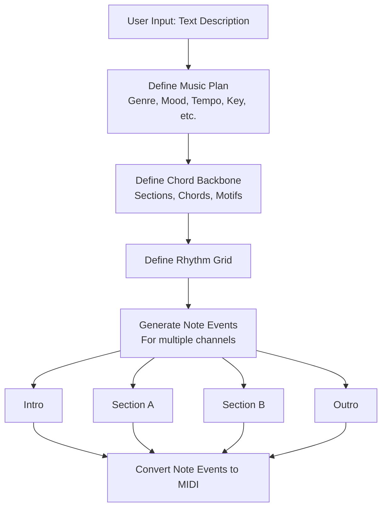
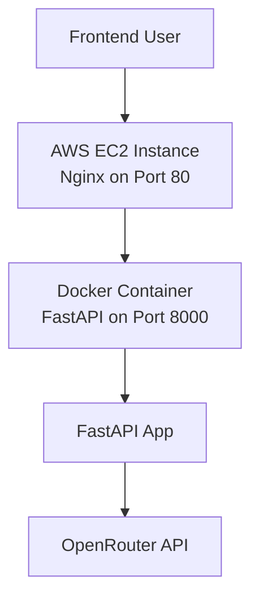

# AnyLLM2Music-backend

Can any reasonable LLM generate good music?

This project aims at using purely LLM to create multiple-channel music, given user prompts and instructions.

## Project Overview



## Tech Stack

- LLM: Any OpenAI compatible models API (`x-ai/grok` for development usage)
- Midi generation: `mido`
- API gateway: `FastAPI`

# Fastapi details (from template)

## Project Structure

```
src/
├── __init__.py
├── main.py          # FastAPI app instance and router includes
└── routes/
    ├── __init__.py
    └── root.py      # Root routes (/, /health)
tests/
├── __init__.py
└── test_main.py     # Basic tests for the API endpoints
```

## Quick Setup

For a one-click setup, run the provided script:

```bash
./setup.sh
```

This script will:
- Install Poetry if it's not already installed
- Install project dependencies (including development dependencies)
- Create a `.env` file from the template (if it doesn't exist)

After running the script, you can start the server as described below.

## Installation

### Installing Poetry

If Poetry is not installed on your system, you can install it using the following command. This works on Linux-based OS and macOS:

```bash
curl -sSL https://install.python-poetry.org | python3 -
```

After installation, you may need to restart your terminal or source your shell configuration to make Poetry available in your PATH.

### Installing Dependencies

To install the project dependencies defined in `pyproject.toml`, run:

```bash
poetry install
```

For development (including testing and linting tools), run:

```bash
poetry install --with dev
```

This will install all the required dependencies, including FastAPI, Uvicorn, Pydantic, and python-dotenv, as well as optional development dependencies like pytest, ruff, and black.

## Environment Configuration

This project uses `python-dotenv` to load environment variables from a `.env` file.

1. Copy the `.env.template` file to `.env` in the root directory of the project.
2. Fill in your actual environment variable values in the `.env` file.

Example `.env` file:

```
OPENROUTER_URL=https://openrouter.ai/api/v1
OPENROUTER_API_KEY=
```

The application will automatically load these variables when running.

## Running the Server

To start the local Uvicorn server with FastAPI, use the following command:

```bash
poetry run uvicorn src.main:app --reload
```

This will start the server in development mode with auto-reload enabled. The API will be available at `http://127.0.0.1:8000`.

## Testing

To run the tests, use:

```bash
poetry run pytest
```

This will run all tests in the `tests/` directory.

# Local Docker Testing

```bash
docker build -t anyllm2music-backend .
docker run -p 8000:8000 anyllm2music-backend
```

## Cloud Architecture



## Deployment

The application is deployed via CI/CD to an AWS EC2 instance:
- **Infrastructure**: Provisioned separately in a dedicated repo using Terraform.
- **Application**: Built as a Docker image, pushed to Docker Hub, and deployed to the EC2 via SSH.
- **API Access**: Available at the EC2's public IP on port 80.

For testing the deployed API, use endpoints like:
- Health: `http://<ec2-public-ip>/health`
- Generate Music: `http://<ec2-public-ip>/generate_midi_from_description?description=your%20music%20description`