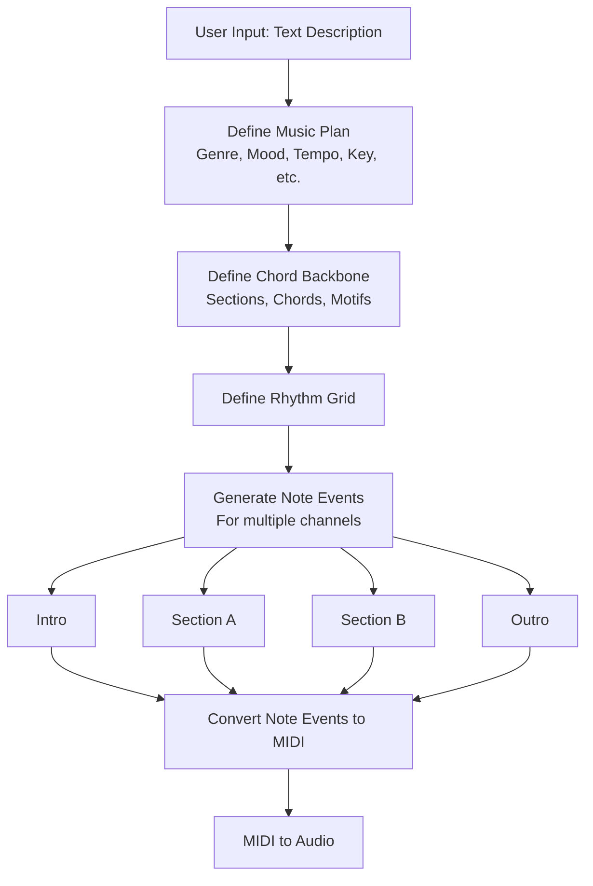
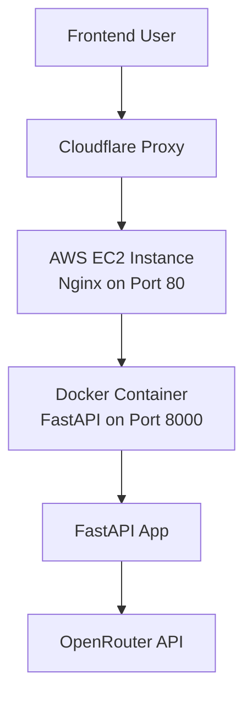

# AnyLLM2Music-backend

Can any reasonable LLM generate good music?

This project aims at using purely LLM to create multiple-channel music, given user prompts and instructions.

## Project Overview


```mermaid
graph TD;
    A[User Input: Text Description] --> B[Define Music Plan<br/>Genre, Mood, Tempo, Key, etc.];
    B --> C[Define Chord Backbone<br/>Sections, Chords, Motifs];
    C --> D[Define Rhythm Grid];
    D --> E[Generate Note Events<br/>For multiple channels];
    E --> E1[Intro];
    E --> E2[Section A];
    E --> E3[Section B];
    E --> E4[Outro];
    E1 --> F[Convert Note Events to MIDI];
    E2 --> F
    E3 --> F
    E4 --> F
    F --> G[MIDI to Audio]
```

## New Multi-Step API

To improve user experience and reduce processing time, the API has been split into multiple steps allowing user confirmation and editing at each stage.

The flow is:

1. **Generate Plan**: POST `/v1/music/generate_plan` with description -> returns MusicPlan

2. **Generate Chords**: POST `/v1/music/generate_chords` with MusicPlan -> returns MusicChords

3. **Generate Rhythm**: POST `/v1/music/generate_rhythm` with MusicChords -> returns MusicRhythm

4. **Generate MIDI**: POST `/v1/music/generate_midi` with MusicPlan and MusicRhythm -> returns MIDI data

5. **Convert MIDI to Audio**: POST `/v1/music/convert_midi_to_audio` with MIDI data -> returns WAV audio data

Users can edit the returned data on the frontend and send the modified version to the next step.

The old endpoint `/v1/music/generate_midi_from_description` remains available for backward compatibility.

## Tech Stack

- LLM: Any OpenAI compatible models API (`x-ai/grok` for development usage)
- Midi generation: `mido`
- Audio synthesis: `midi2audio` with FluidSynth
- API gateway: `FastAPI`

# Fastapi details (from template)

## Project Structure

```
src/
├── __init__.py
├── main.py          # FastAPI app instance and router includes
├── assets/
│   └── soundfonts/  # Custom soundfonts for audio synthesis
├── routes/
│   ├── __init__.py
│   ├── midi.py      # MIDI generation and conversion routes
│   └── root.py      # Root routes (/, /health)
└── services/
    ├── midi.py      # MIDI file handling utilities
    └── ...
tests/
├── __init__.py
├── test_midi.py     # MIDI service tests
├── test_routes.py   # API endpoint tests
└── ...
```

## Quick Setup

For a one-click setup, run the provided script:

```bash
./setup.sh
```

This script will:
- Install Poetry if it's not already installed
- Install project dependencies (including development dependencies)
- Create a `.env` file from the template (if it doesn't exist)

After running the script, you can start the server as described below.

## Installation

### Installing Poetry

If Poetry is not installed on your system, you can install it using the following command. This works on Linux-based OS and macOS:

```bash
curl -sSL https://install.python-poetry.org | python3 -
```

After installation, you may need to restart your terminal or source your shell configuration to make Poetry available in your PATH.

### Installing Dependencies

To install the project dependencies defined in `pyproject.toml`, run:

```bash
poetry install
```

For development (including testing and linting tools), run:

```bash
poetry install --with dev
```

This will install all the required dependencies, including FastAPI, Uvicorn, Pydantic, and python-dotenv, as well as optional development dependencies like pytest, ruff, and black.

### Installing FluidSynth for MIDI to Audio Conversion

For local testing of MIDI to audio conversion features, install FluidSynth:

```bash
sudo apt-get update
sudo apt-get install fluidsynth
```

This is required for the `midi2audio` library to function properly.

## Environment Configuration

This project uses `python-settings` to load environment variables from a `.env` file.

1. Copy the `.env.template` file to `.env` in the root directory of the project.
2. Fill in your actual environment variable values in the `.env` file.

Example `.env` file:

```
OPENROUTER_URL=https://openrouter.ai/api/v1
OPENROUTER_API_KEY=
...
```

The application will automatically load these variables when running.

## Running the Server

To start the local Uvicorn server with FastAPI, use the following command:

```bash
poetry run uvicorn src.main:app --reload
```

This will start the server in development mode with auto-reload enabled. The API will be available at `http://127.0.0.1:8000`.

## Testing

To run the tests, use:

```bash
poetry run pytest
```

This will run all tests in the `tests/` directory.

# Local Docker Testing

For easy local testing, use the provided script:

```bash
chmod u+x ./docker-local-test.sh # for exec right
./docker-local-test.sh
```

This script:
- Builds the Docker image (copies your `.env` file into the container)
- Runs the container
- Performs basic health checks

**Note**: The script requires a `.env` file with real API keys (e.g., `OPENROUTER_API_KEY`). If you don't have one, copy `.env.template` to `.env` and fill in the values.

Ensure the script is executable: `chmod +x docker-local-test.sh`

The script maps the container's port 443 (HTTPS) to host port 8000 for easy access.

## Cloud Architecture


```mermaid
graph TD
    A[Frontend User] --> B[Cloudflare Proxy]
    B --> C[AWS EC2 Instance<br/>Nginx on Port 80]
    C --> D[Docker Container<br/>FastAPI on Port 8000]
    D --> E[FastAPI App]
    E --> F[OpenRouter API]
```

## Deployment

The application is deployed via CI/CD to an AWS EC2 instance:
- **Infrastructure**: ECR repository provisioned using Terraform (see `terraform/main.tf`). EC2 instance managed separately.
- **Application**: Built as a Docker image, pushed to AWS ECR, and deployed to the EC2 via AWS Systems Manager.
- **Security**: Uses IAM roles for ECR access and SSM for secure command execution.
- **API Access**: Available at the EC2's public IP on port 80/443.
